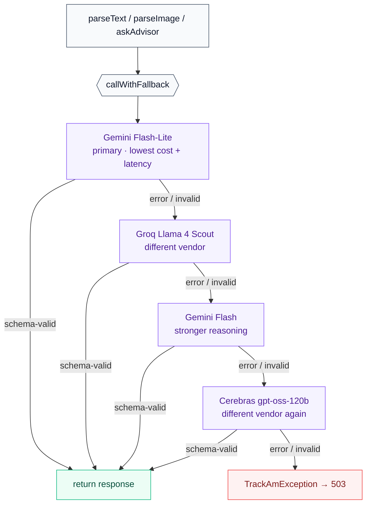

# TrackAm API

**Spring Boot backend for [TrackAm](https://github.com/Phinart98/trackam).** AI-powered financial intelligence for Africans the credit system forgot, from market traders to salaried professionals. The structured transaction history this backend stores is the missing foundation for fair African credit scoring. BeOrchid Africa Developers Hackathon 2026 (FinTech track).

→ Live: deployed on Google Cloud Run (`europe-west1`)
→ Frontend repo: [trackam](https://github.com/Phinart98/trackam) (Nuxt 4, deployed on Vercel)
→ Architecture: [trackam/docs/ARCHITECTURE.md](https://github.com/Phinart98/trackam/blob/master/docs/ARCHITECTURE.md)

---

## Stack

- **Java 21** · **Spring Boot 3.4** · **Spring AI 1.0.4**
- **PostgreSQL 17 + pgvector** via Supabase (transaction pooler, `prepareThreshold=0`)
- **Supabase Auth** with the JWT validated via JWKS (ES256), no shared secret
- **AI providers**: Groq (Llama 4 Scout vision), Google Gemini Flash-Lite / Flash (text parsing + advisor chat), Cerebras gpt-oss-120b (fallback)
- **Container**: Docker multi-stage, non-root `app` user, JRE-alpine runtime

## How the AI layer works

Calling an LLM is the easy part. What this backend adds is the **reliability layer** wrapped around every call, built on Spring AI's structured-output and multimodal APIs.

### Multi-provider fallback chain (`AiService.callWithFallback`)



The chain survives any single vendor's outage. Each attempt is logged asynchronously via `AuditService` (operation, latency, success/fail), so production failures are visible per provider.

### Vision parsing (`AiService.parseImage`)

Receipts and MoMo screenshots go through `parseImage(MultipartFile file, ...)`:

1. `InputGuardrail.validateImage(file)` runs a **magic-byte check** (JPEG/PNG/GIF/WebP headers), enforces a size limit, and rejects MIME spoofing
2. `file.getBytes()` is read **once** into a `ByteArrayResource` and reused across fallback attempts (no double-read bug)
3. The `callWithFallback` chain runs Groq Llama 4 Scout (vision) then Gemini Flash (vision)
4. Structured output lands in the same `ParsedTransactionResponse` DTO as text parsing

### Advisor: context stuffing with server-side data scoping (`AiService.askAdvisor`)

The advisor answers questions grounded in the user's real transactions. Earlier iterations used Spring AI tool-calling, but for an interactive chat the extra round-trips made first-token latency too slow. The current implementation uses **server-controlled context stuffing**, which is faster and equally safe.

- For each turn, the backend loads the authenticated user's transactions from Postgres, scoped by the `userId` from the JWT subject and never trusted from the chat input.
- `buildCompactContext` aggregates these into a token-efficient summary: monthly income/expense totals, top categories, and the 10 most recent transactions. Context engineering rather than dumping raw rows.
- The system prompt combines this aggregated context with `AdvisorPrompt.SYSTEM` and the last 6 conversation messages as proper role-based history (`UserMessage` / `AssistantMessage`).
- The model never sees other users' data. There is no LLM-controlled tool argument that could be hallucinated to fetch a different user's records.
- Conversation history persists to `chat_sessions` + `chat_messages` for multi-turn chat.

`AdvisorTools` exists in the source tree as scaffolding for future tool-calling, kept behind a feature decision rather than deleted.

### Input and output guardrails

- `InputGuardrail` rejects prompt-injection patterns, validates magic bytes for images, enforces size limits, and rejects non-financial queries on parse endpoints
- `OutputGuardrail` clamps impossible amounts, rejects future-dated transactions, and ensures the returned `category` is in the user's actual category set, so no hallucinated categories reach the DB

### Per-user rate limit (`SecurityConfig.AiRateLimitFilter`)

A sliding-window per-`userId` rate limiter on `/api/ai/**`: 60 requests per minute. On limit hit it returns `429` with a `Retry-After` header. Implemented with `ConcurrentHashMap<userId, Deque<timestamp>>` and TOCTOU-safe eviction.

### Embeddings: native Gemini, not OpenAI-compat

`EmbeddingService` uses the **native Gemini `gemini-embedding-001`** endpoint, not the OpenAI-compat shim. The shim's `dimensions` parameter was unreliable. The native endpoint returns deterministic 768-dim vectors that match the `pgvector(768)` column on `transactions.embedding`.

## Security

- **JWT via JWKS.** `NimbusJwtDecoder.withJwkSetUri(...)` with `JwsAlgorithm.ES256`, `JwtIssuerValidator`, and an audience validator (`"authenticated"`). No shared HMAC secret to leak or rotate.
- **Per-user scoping in every controller.** `userId = UUID.fromString(jwt.getSubject())` is the single source of truth, and every repository query is scoped by it. No IDOR path.
- **Stateless sessions.** `SessionCreationPolicy.STATELESS`, no server-side session store.
- **Strict CORS.** The production origin is pinned via `FRONTEND_URL`, with `http://localhost:*` permitted through `allowedOriginPatterns` for local dev. Verified empirically: legit localhost passes, `localhost.evil.com` gets 403.
- **CSRF disabled**, which is correct for stateless Bearer-token APIs since cookies are not used for auth.
- **HSTS, frame-deny, and CSP `default-src 'none'`** on backend responses.
- **GDPR endpoints.** `GET /api/user/export` and `DELETE /api/user/data`, both scoped by the JWT subject. Delete cascades chat, categories, goals, transactions, and profile.
- **Container hardening.** The Dockerfile runtime stage runs as non-root `app:app`, with the JAR copied using `--chown=app:app`.

## Local setup

**Prerequisites:** Java 21, Maven 3.9+

1. Copy the local config template:
   ```bash
   cp application-local.yml.example application-local.yml
   ```
   Fill in Supabase DB credentials and AI provider keys.

2. Run:
   ```bash
   mvn spring-boot:run "-Dspring-boot.run.profiles=local"
   ```

The API runs at `http://localhost:8080`. Hit `http://localhost:8080/actuator/health` to confirm.

## Environment variables

See `.env.example` for the full list used in production (Cloud Run).

Key ones:
- `SUPABASE_JDBC_URL` must use port `6543` (transaction pooler) with `prepareThreshold=0`
- `SUPABASE_DB_USER` / `SUPABASE_DB_PASSWORD`
- `SUPABASE_URL`, used to build the JWKS URI (`/auth/v1/.well-known/jwks.json`)
- `FRONTEND_URL`, the CORS allowed origin in production (localhost is auto-allowed)
- `GROQ_API_KEY` / `GEMINI_API_KEY` / `CEREBRAS_API_KEY`, at least one of which must be valid

For local dev, use `application-local.yml` instead of env vars. Spring Boot reads it directly when the `local` profile is active.

## Deployment

Deploys to Google Cloud Run via a Cloud Build trigger on push to `master`:

```
GitHub push → Cloud Build → Docker (multi-stage) → Artifact Registry
              → Cloud Run deploy (europe-west1, --cpu-boost, min-instances=0)
```

The image is tagged with the git SHA. Health check: `wget /actuator/health` every 30s with a 60s start-up grace period.

## Project structure

```
src/main/java/com/trackam/
├── config/              # SecurityConfig (JWT/JWKS/CORS/rate-limit), AiConfig, AppProperties, BeansConfig
├── controller/          # REST endpoints: Ai, Transaction, Profile, Goal, CustomCategory,
│                        # Dashboard, Fx, UserData (GDPR), Metrics
├── service/             # AiService (fallback chain), TransactionService, GoalService, DashboardService,
│                        # AuditService (async logging), ExchangeRateService, EmbeddingService
├── repository/          # JPA repositories, every query scoped by userId
├── model/               # JPA entities (Transaction, BusinessProfile, Goal, CustomCategory,
│                        # ChatSession, ChatMessage, AuditLog), all timestamps Instant
├── dto/                 # Request/response types
├── ai/
│   ├── prompts: TextParserPrompt, ImageParserPrompt, AdvisorPrompt, InsightPrompt, CategoryPromptHelper
│   ├── guardrails/      # InputGuardrail, OutputGuardrail
│   └── tools/           # AdvisorTools, scaffolding for future tool-calling (not wired into the current advisor path)
└── exception/           # TrackAmException, GlobalExceptionHandler (sanitizes errors)
src/main/resources/
├── application.yml      # Shared config (env-driven)
└── db/schema.sql        # Postgres schema (run once in Supabase)
```

## Testing

```bash
mvn test
```

See `src/test/java/com/trackam/` for the test suite covering JWT validation, the AI fallback chain, and the input guardrails.
